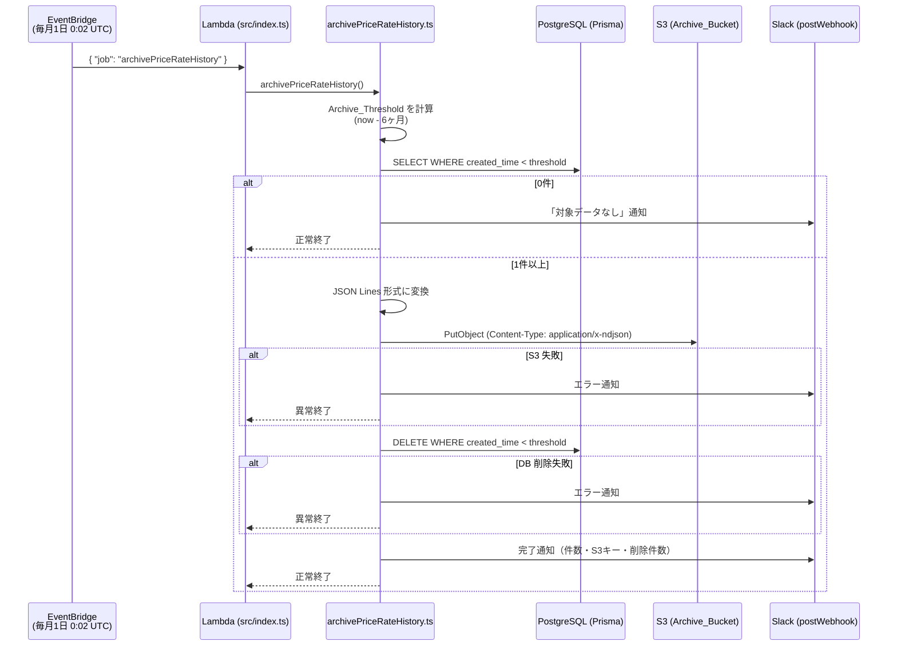

# Design Document: price-rate-history-archive

## Overview

`priceRateHistory` テーブルに蓄積される仮想通貨レートデータは毎時挿入されるため、長期運用でレコード数が膨大になりクエリ性能が劣化するリスクがある。本機能は、実行時点から 6ヶ月以上前のデータを S3（JSON Lines 形式）にアーカイブして DB から削除する月次バッチ処理を新設する。

**目的:**
- `priceRateHistory` テーブルの肥大化防止によるクエリ性能の維持
- アーカイブデータを S3 に保持することで、後からの参照・復元を可能にする
- 既存の Lambda エントリポイント・EventBridge パターンに準拠した実装で保守性を担保する

**スコープ:**
- バックエンド: `src/archivePriceRateHistory.ts`（バッチ本体）
- エントリポイント: `src/index.ts`（`job: 'archivePriceRateHistory'` ルーティング追加）
- インフラ: `infra/lib/infra-stack.ts`（S3 バケット・EventBridge ルール・IAM ポリシー追加）

---

## Architecture

### 全体フロー



### S3 キー構成

```
Archive_Bucket (ccnotifier-price-rate-archive)
└── price-rate-history/
    └── YYYY/
        └── MM/
            └── price-rate-history-YYYY-MM-DD.jsonl
```

YYYY/MM/DD はバッチ実行時の **UTC 日付**。

---

## Components and Interfaces

### 1. `src/archivePriceRateHistory.ts`（新規）

バッチ処理の本体。以下の純粋関数とオーケストレーション関数で構成する。

```typescript
/** アーカイブバッチのメイン関数（Lambda から呼び出し） */
export async function archivePriceRateHistory(): Promise<void>

/** 実行時刻から Archive_Threshold を計算する純粋関数 */
export function calcArchiveThreshold(now: Date): Date

/** 実行時刻から S3 キーを生成する純粋関数 */
export function buildS3Key(now: Date): string

/** レコード配列を JSON Lines 文字列に変換する純粋関数 */
export function toJsonLines(records: PriceRateHistoryRecord[]): string

/** Slack 通知メッセージを生成する純粋関数 */
export function buildSuccessMessage(params: {
  archivedCount: number;
  s3Key: string;
  deletedCount: number;
}): string
```

#### 内部型定義

```typescript
type PriceRateHistoryRecord = {
  id: number;
  brand: string;
  bid_price: Decimal | null;
  ask_price: Decimal | null;
  created_time: Date | null;
};
```

### 2. `src/index.ts`（変更）

既存のジョブルーティングブロックに `archivePriceRateHistory` を追加する。

```typescript
// 変更前（既存のelse節）
} else {
  await allRateCheckAndPost({ isRegularly: true });
}

// 変更後
} else if (job === 'archivePriceRateHistory') {
  await archivePriceRateHistory();
} else {
  await allRateCheckAndPost({ isRegularly: true });
}
```

### 3. `infra/lib/infra-stack.ts`（変更）

追加する CDK リソース:

| リソース | 内容 |
|---------|------|
| `s3.Bucket` | `ccnotifier-price-rate-archive`（パブリックアクセスブロック・ライフサイクルルール） |
| `iam.PolicyStatement` | Lambda に `s3:PutObject` 権限を付与（Archive_Bucket のオブジェクト） |
| `events.Rule` | `cron(2,0,1,*,?,*)` で月次スケジュール実行 |
| `targets.LambdaFunction` | `{ job: 'archivePriceRateHistory' }` を入力として Lambda を呼び出し |

---

## Data Models

### `priceRateHistory`（既存テーブル）

```prisma
model priceRateHistory {
  id           Int       @id @default(autoincrement())
  brand        String    @db.VarChar(5)
  bid_price    Decimal?
  ask_price    Decimal?
  created_time DateTime? @db.Timestamp(6)

  @@index([brand, created_time])
}
```

アーカイブ対象の抽出クエリ:
```typescript
prisma.priceRateHistory.findMany({
  where: { created_time: { lt: archiveThreshold } },
  orderBy: { id: 'asc' }
})
```

DB 削除クエリ:
```typescript
prisma.priceRateHistory.deleteMany({
  where: { created_time: { lt: archiveThreshold } }
})
```

### Archive_File フォーマット（JSON Lines）

各行は以下のオブジェクトの JSON 文字列。`Decimal` 型は `toString()` で文字列にシリアライズする。

```json
{"id":1,"brand":"BTC","bid_price":"5000000.00","ask_price":"5001000.00","created_time":"2024-01-01T00:00:00.000Z"}
{"id":2,"brand":"ETH","bid_price":"300000.00","ask_price":"300500.00","created_time":"2024-01-01T00:00:00.000Z"}
```

---

## Correctness Properties

*プロパティとは、システムの有効な実行すべてにおいて成立すべき特性・振る舞いのこと。要件を機械検証可能な仕様として表現するものである。*

### Property 1: 閾値は常に実行時刻の6ヶ月前である

*任意の* 実行時刻 `now` に対して、`calcArchiveThreshold(now)` が返す閾値は `now` から正確に 6ヶ月前（ミリ秒単位で一致）でなければならない。

**Validates: Requirements 1.1**

### Property 2: S3 キーは実行日の UTC 値を正確に反映する

*任意の* 実行時刻 `now` に対して、`buildS3Key(now)` が返す文字列は `price-rate-history/YYYY/MM/price-rate-history-YYYY-MM-DD.jsonl` のパターン（`YYYY/MM/DD` は `now` の UTC 年月日）に一致しなければならない。

**Validates: Requirements 2.2**

### Property 3: JSON Lines シリアライズはすべての列を保持する（ラウンドトリップ）

*任意の* `PriceRateHistoryRecord` 配列に対して、`toJsonLines()` で生成した文字列を行単位で `JSON.parse()` した結果は、元のレコードと同一の `id`・`brand`・`bid_price`・`ask_price`・`created_time` を保持しなければならない。また出力の行数はレコード数と等しく、各行は valid JSON でなければならない。

**Validates: Requirements 1.4, 2.1**

### Property 4: S3 キーの行数は常にレコード数と一致する

*任意の* n 件のレコード配列を `toJsonLines()` に渡したとき、改行区切りで分割した行数は n と等しくなければならない（末尾の空行を除く）。

**Validates: Requirements 2.1**

> **注記**: Property 3 が成立すれば Property 4 も含意されるが、JSON Lines の「1レコード1行」性質をより明示的に保証するため独立したプロパティとして残す。

### Property 5: 成功メッセージはすべての必須情報を含む

*任意の* アーカイブ件数・S3 キー・削除件数を引数として `buildSuccessMessage()` を呼び出したとき、返される文字列にはそれぞれの値がすべて含まれなければならない。

**Validates: Requirements 4.1**

---

## Error Handling

| エラーケース | 対処 | DB 削除 | Slack 通知 |
|------------|------|---------|-----------|
| 抽出件数 0 件 | 正常終了 | スキップ | 「対象データなし」メッセージを送信 |
| S3 アップロード失敗 | 例外をキャッチして異常終了 | **実行しない** | エラー内容を送信 |
| DB 削除失敗 | 例外をキャッチして異常終了 | — | エラー内容を送信 |
| Slack 通知失敗 | ベストエフォート（エラーをログ出力して処理続行） | 影響なし | — |

**S3 アップロード成功前の DB 削除は行わない**。これにより、アップロード失敗時のデータ損失を防ぐ。S3 への書き込みが確認できた後にのみ削除を実行する設計とする。

S3 に保存済みのアーカイブファイルは DB 削除失敗時に削除しない（冪等性を優先）。再実行時は同一キーで上書きアップロードされるため整合性は保たれる。

---

## Testing Strategy

### ユニットテスト（純粋関数）

各純粋関数はモック不要で直接テストできる。Jest + ts-jest で実装する（プロジェクト既存の設定を利用）。

| 対象関数 | テスト内容 |
|---------|----------|
| `calcArchiveThreshold` | 具体的な日付（月末・月初・うるう年）での閾値計算 |
| `buildS3Key` | UTC 年月日の反映、フォーマット正確性 |
| `toJsonLines` | 全列の保持、行数一致、valid JSON、Decimal/null の扱い |
| `buildSuccessMessage` | 必須情報（件数・S3キー）の包含 |

### プロパティベーステスト

PBT ライブラリ: **fast-check**（TypeScript ネイティブ対応、Node.js で広く利用）

```bash
npm install --save-dev fast-check
```

各プロパティテストは最低 100 イテレーション実行する。

| プロパティ | fast-check 戦略 |
|-----------|----------------|
| Property 1: 閾値計算 | `fc.date()` で任意の Date を生成 |
| Property 2: S3 キー形式 | `fc.date()` で任意の Date を生成し、正規表現 + UTC 値の一致を検証 |
| Property 3: ラウンドトリップ | `fc.array(fc.record({id, brand, bid_price, ask_price, created_time}))` でレコード配列を生成 |
| Property 4: 行数一致 | `fc.array(...)` で n 件生成し行数が n と等しいことを検証 |
| Property 5: メッセージ包含 | `fc.integer()`・`fc.string()` でランダムな件数・キーを生成 |

タグ形式: `// Feature: price-rate-history-archive, Property {N}: {property_text}`

### example ベーステスト（モックあり）

Jest `jest.mock()` で Prisma・S3Client・postWebhook を差し替えて検証する。

| シナリオ | 検証内容 |
|---------|---------|
| 正常完了（1件以上） | S3 PutObject → DB deleteMany の順で呼ばれること |
| 0 件 | PutObject・deleteMany が呼ばれないこと、Slack に「対象データなし」が送られること |
| S3 失敗 | DB deleteMany が呼ばれないこと、Slack エラー通知が送られること |
| DB 削除失敗 | Slack エラー通知が送られること |
| ルーティング | `{job: 'archivePriceRateHistory'}` で `archivePriceRateHistory()` が呼ばれること |

### CDK スナップショットテスト（インフラ）

既存の `infra/test/` にスナップショットテストを追加する。

| 検証対象 | 内容 |
|---------|------|
| Archive_Bucket | `BlockPublicAccess: ALL`、`LifecycleRule: GLACIER transition 365日`が設定されていること |
| IAM ポリシー | Lambda ロールに `s3:PutObject` 権限が付与されていること |
| EventBridge ルール | cron 式が `cron(2,0,1,*,?,*)` であること |
| Lambda ターゲット入力 | `{ "job": "archivePriceRateHistory" }` が設定されていること |
